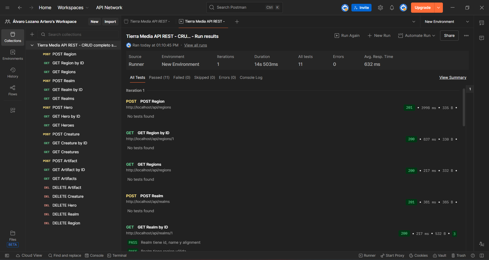
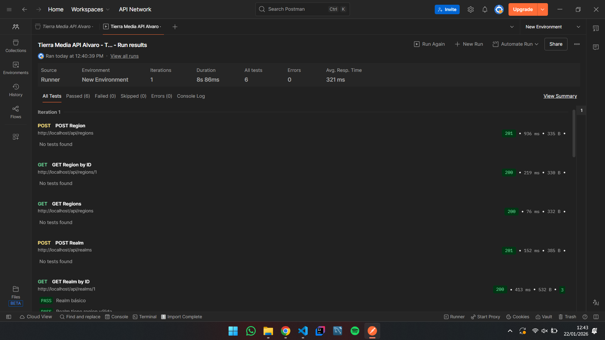

# Tierra Media API REST

Esta es una API REST construida con **Laravel** que gestiona información del universo ficticio de la **Tierra Media**. Permite consultar y administrar **regiones, reinos, héroes, criaturas y artefactos**, así como las relaciones entre héroes y artefactos.

---

## Estructura de la base de datos

**Tablas principales:**

- `regions`: almacena las regiones de la Tierra Media.  
- `realms`: almacena los reinos y su información básica, incluyendo la relación con una región.  
- `heroes`: almacena héroes, su raza, rango, reino y estado (vivo/muerto).  
- `creatures`: almacena criaturas, su especie, nivel de amenaza y región.  
- `artifacts`: almacena artefactos, su tipo, nivel de poder, descripción y reino de origen.  

**Tablas pivote:**

- `artifact_hero`: relación N:N entre héroes y artefactos.

---

## Migraciones y seeders

1. Ejecutar migraciones para crear todas las tablas:

```bash
./vendor/bin/sail artisan migrate
```

2. Cargar datos de pruebas con seeder
```bash
.vendor/bin/sail artisan db:seed
```
> Esto insertará datos iniciales de regiones, reinos, héroes, criaturas, artefactos y sus relaciones.

---

## Endpoints principales

### Regiones (`regions`)

- `GET /api/regions` → Listar todas las regiones  
- `GET /api/regions/{id}` → Obtener una región concreta  
- `POST /api/regions` → Crear una región  
- `PUT /api/regions/{id}` → Actualizar una región  
- `DELETE /api/regions/{id}` → Eliminar una región  

### Reinos (`realms`)

- `GET /api/realms` → Listar todos los reinos  
- `GET /api/realms/{id}` → Detalles de un reino (incluye región, héroes y artefactos)  
- `POST /api/realms` → Crear un nuevo reino  
- `PUT /api/realms/{id}` → Actualizar un reino  
- `DELETE /api/realms/{id}` → Eliminar un reino  

### Héroes (`heroes`)

- `GET /api/heroes` → Listar héroes  
- `GET /api/heroes/{id}` → Detalles de un héroe (incluye reino y artefactos)  
- `POST /api/heroes` → Crear un héroe  
- `PUT /api/heroes/{id}` → Actualizar un héroe  
- `DELETE /api/heroes/{id}` → Eliminar un héroe  

### Criaturas (`creatures`)

- `GET /api/creatures` → Listar criaturas  
- `GET /api/creatures/{id}` → Detalles de una criatura (incluye región)  
- `POST /api/creatures` → Crear una criatura  
- `PUT /api/creatures/{id}` → Actualizar una criatura  
- `DELETE /api/creatures/{id}` → Eliminar una criatura  

### Artefactos (`artifacts`)

- `GET /api/artifacts` → Listar artefactos  
- `GET /api/artifacts/{id}` → Detalles de un artefacto (incluye reino y héroes que lo poseen)  
- `POST /api/artifacts` → Crear un artefacto  
- `PUT /api/artifacts/{id}` → Actualizar un artefacto  
- `DELETE /api/artifacts/{id}` → Eliminar un artefacto  

### Relación héroes ↔ artefactos (`artifact_hero`)

- `POST /api/artifact-hero` → Asignar un artefacto a un héroe  
- `DELETE /api/artifact-hero` → Retirar un artefacto de un héroe  
- `GET /api/heroes/{id}/artifacts` → Listar artefactos de un héroe  
- `GET /api/artifacts/{id}/heroes` → Listar héroes que poseen un artefacto  

### Endpoints adicionales

- `GET /api/heroes/alive` → Listar héroes vivos  
- `GET /api/creatures/dangerous?level={n}` → Listar criaturas con nivel de amenaza ≥ `n`  
- `GET /api/artifacts/top` → Listar artefactos con `power_level > 90`  

---

## Pruebas

La API ha sido probada con **Postman**, con todos los tests pasando correctamente. Se incluye un archivo de exportación `.postman_test_run.json` con los resultados de la prueba.

Para ejecutar pruebas manuales, se recomienda importar la colección de Postman y lanzar los requests sobre `http://localhost/api`.

## Captura de Postman – Colección del profesor

La siguiente captura muestra la ejecución de los tests de la API REST de la Tierra Media usando la colección proporcionada por el profesor. Se puede observar que todos los tests se han completado **correctamente**, indicando que los endpoints funcionan según lo esperado:



---

## Captura de Postman – Colección propia

La siguiente imagen corresponde a la ejecución de los tests utilizando mi propia colección personalizada. Todos los tests también se han completado **con éxito**, demostrando que la colección propia valida correctamente los endpoints y sus relaciones:

